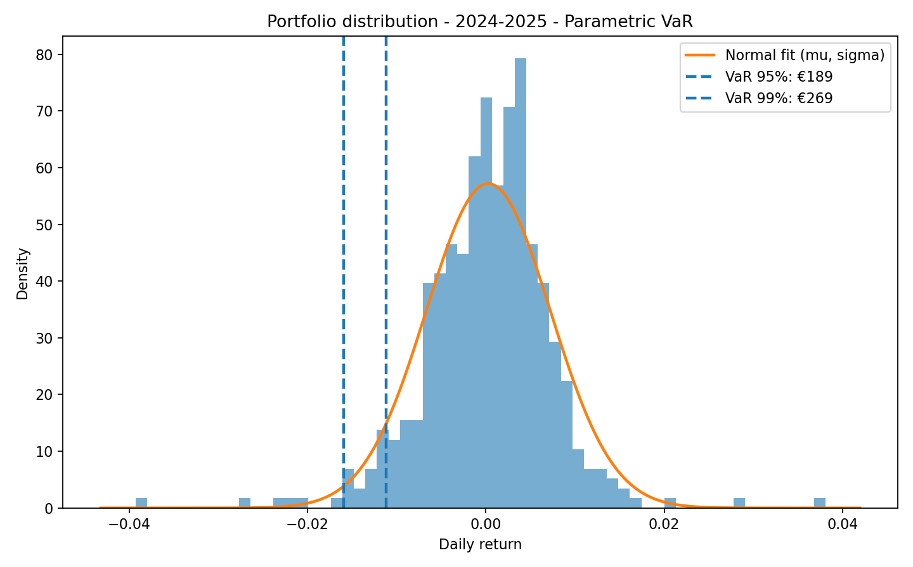

# 📊 Value-at-Risk (VaR) — Multi-Asset, Interactive

Interactive Python tool to compute 1-day VaR for multi-asset portfolios (equities, ETFs, commodity futures, FX, crypto) using Yahoo Finance data.

All series are converted to a base currency you choose (default EUR), then four VaR methods are compared on two horizons (2024→today and 2015→today).

---

## ✅ What the code does

- Downloads prices for user-provided tickers.
- Converts every series to the chosen base currency via Yahoo FX.
- Aligns data to a common calendar (Business Days by default).
- Computes portfolio log-returns from user amounts/weights.
- Calculates VaR 95% & 99% with four methods:
  - Parametric (Normal)
  - Historical Simulation
  - Monte Carlo (Normal multivariate)
  - Monte Carlo (t-Student multivariate) with df estimated from excess kurtosis
- Produces charts with VaR lines, CSV summary, and plain-language messages.
---
## 🛠️ How it was built (step-by-step)

**Input (CLI, interactive).**  
Ask for: tickers, base currency (ISO-3), amounts in base currency.

1. **Download prices**  
   `yfinance.download(..., auto_adjust=True)` → adjusted close.  
   Detect quote currency via `fast_info["currency"]`.  
   If quote ≠ base → download FX pair `BASEQUOTE=X` and convert:

$$
P^{\text{base}}_t = \frac{P^{\text{quote}}_t}{\text{FX}^{\text{BASE/QUOTE}}_t}
$$

2. **Calendar alignment**  
Reindex to **Business Days** (“B”) and forward-fill gaps (crypto 24/7, others don’t).

3. **Portfolio returns**  
Compute log-returns per asset $r_t=\ln(P_t/P_{t-1})$; aggregate with weights $w$:

$$
r^{(p)}_t = \mathbf{w}^\top \mathbf{r}_t
$$

Total capital $V$ = sum of user amounts.

4. **VaR engines (confidence $\alpha\in\{0.95,0.99\}$)**

**a) Parametric (Normal)**  
Estimate $\mu_p,\sigma_p$; left-tail quantile $q_{1-\alpha}=\mu_p+\sigma_p\\Phi^{-1}(1-\alpha)$.  
**VaR (currency):**

$$
\mathrm{VaR}_\alpha = -q_{1-\alpha}V
= -\big(\mu_p+\sigma_p\\Phi^{-1}(1-\alpha)\big)V
$$

**b) Historical Simulation**  
Empirical left-tail quantile of portfolio returns:

$$
\mathrm{VaR}_\alpha = -Q_{1-\alpha}\!\big(r^{(p)}\big)V
$$

**c) Monte Carlo — Normal multivariate**  
Estimate $\boldsymbol\mu$, $\boldsymbol\Sigma$. Simulate
$\mathbf{r}=\boldsymbol\mu+L\mathbf{z}$ with $L$ Cholesky of $\boldsymbol\Sigma$ and
$\mathbf{z}\sim\mathcal{N}(\mathbf{0},I)$; take $Q_{1-\alpha}$ of $r^{(p)}=\mathbf{w}^\top\mathbf{r}$:

$$
\mathrm{VaR}_\alpha = -Q_{1-\alpha}\!\big(r^{(p)}\big)V
$$

**d) Monte Carlo — t-Student multivariate (fat tails)**  
Same $\boldsymbol\mu,\boldsymbol\Sigma$. Degrees of freedom $\nu$ from excess kurtosis $g_2$
(e.g., $\nu \approx 4 + \frac{6}{g_2}$, con clipping). Draw $\mathbf{z}\sim\mathcal{N}(\mathbf{0},I)$, $s\sim\chi^2_{\nu}/\nu$, then

$$
\mathbf{r} = \boldsymbol\mu + \frac{L\mathbf{z}}{\sqrt{s}}
$$

Aggregate and take $Q_{1-\alpha}$ as above:

$$
\mathrm{VaR}_\alpha = -Q_{1-\alpha}\!\big(r^{(p)}\big)V
$$

5. **Outputs**  
CSV table (VaR by method & horizon), 8 charts (method × horizon), and plain-language messages.

---
## 📚 Libraries used (and why)

- yfinance – free Yahoo Finance access (prices & FX).
- pandas – time-series handling, joins, resampling, CSV export.
- numpy – vector math, random draws, percentiles.
- scipy.stats – Normal PDF/quantiles; chi-square for t-mixture.
- matplotlib – histograms + VaR lines for visual inspection.

---
## 🚀 Quick start

Python 3.9+

pip install numpy pandas matplotlib scipy yfinance
python code/var_interactive_multiasset.py

You will be prompted for:

Tickers (comma-separated):
- e.g., NVDA,AAPL,TLT,GLD,BTC-USD,EURUSD=X
- Base currency (ISO-3): EUR (default), USD, GBP, …
- Amounts in base currency (same order as tickers): e.g., 2000,1500,1000,500,300,200
---
## 📤 Outputs

CSV summary → outputs/var_comparison_interactive_multiasset.csv

(VaR 95/99 by method & horizon on your total capital)

Charts → plots/
Console messages (interpretation):

“In the worst 1% of days, you could lose more than €X in one day.”

---
## 🧾 Supported instruments (Yahoo tickers)

Equities / ETFs: AAPL, TLT, EUNL.DE, IWDA.AS, ISP.MI, …

Commodity futures (continuous): CL=F (WTI), GC=F (Gold), SI=F, NG=F, ZC=F, …

FX: EURUSD=X, USDJPY=X, …

Crypto: BTC-USD, ETH-USD, SOL-USD, …

⚠️ Use the correct exchange suffix: .MI (Borsa Italiana), .L (LSE), .DE (Xetra), .PA (Paris), .AS (Amsterdam), etc.

---
## 🧩 Troubleshooting

“FX not found …”
Ensure you typed an ISO-3 base currency (e.g., EUR) and a valid ticker; EUR-quoted assets don’t need FX.

Ticker not found / delisted
Verify spelling and the exchange suffix (.MI, .L, .DE, …).

Weird weekend behavior
Data are aligned to Business Days. To include weekends, set CALENDAR_FREQ = "D" in the script.

I typed amounts where base currency was requested
Re-run and enter just the ISO-3 code (e.g., EUR) at that prompt.

---
## 📝 Notes & Disclaimer

Data source: Yahoo Finance, auto-adjusted prices (splits/dividends).

VaR is a statistical estimate; extreme losses can exceed VaR. Educational use only.

Crypto are 24/7; downsampled to business days by default for comparability.

---
## 📫 Contact
- LinkedIn: [Luigi Di Muzio](https://linkedin.com/in/luigidimuzio)  
- Email: [luigidimu@gmail.com](mailto:luigidimu@gmail.com)
